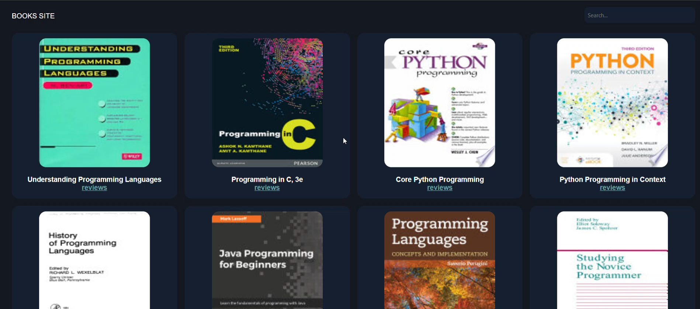

# Books Site

## Description
This is a full-stack application that displays a selection of books, allows users to search for specific books, and enables users to submit and view reviews. The project integrates the Google Books API to retrieve book data and covers, while the backend is built using Node.js, Express, and MongoDB to handle user interactions and reviews.
## Features
- **Home Page**: Displays a selection of 10 books retrieved from the Google Books API, showing their titles and cover images.
- **Search Functionality**: Users can search for books by keyword.
- **Review Submission**: Users can submit reviews for books. Reviews are stored in MongoDB and can be viewed on the book's reviews page.
- **RESTful API**: Custom API endpoints to support adding and retrieving reviews for each book.
## Tech Stack
### Frontend
- **HTML**: Structure and layout of the application.
- **CSS**: Styling for the application.
- **JavaScript**: Handles user interactions, search functionality, and API requests to the backend.
### Backend
- **Node.js**: JavaScript runtime environment for the server.
- **Express**: Framework for building the server and defining API routes.
- **MongoDB**: Database for storing book reviews.
## Getting Started
### Prerequisites
- **Node.js**
- **MongoDB**
### Installation
1. **Clone the repository**:
   ```bash
   git clone https://github.com/mi7773/books_site.git
   cd books_site
   ```
2. **Install dependencies**:
   ```bash
   npm install
   ```
3. **Set up environment variables**:
- **Copy the** `.env.example` **file** to `.env` in the root directory of the project.
   ```bash
   cp .env.example .env
   ```
- **Fill in your MongoDB credentials** in the `.env` file:
   ```
   # MongoDB configuration
   MONGODB_USERNAME=your_username_here
   MONGODB_PASSWORD=your_password_here
   MONGODB_URI=your_mongodb_uri_here
   ```
Make sure you replace the placeholders with your actual MongoDB credentials.
